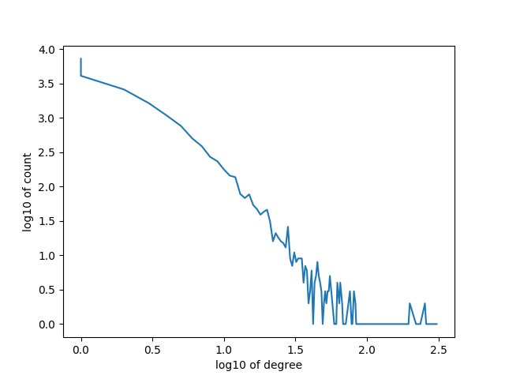

# Getting Started

`python3 run.py`

# Results

Note that this image was generated using only 20k nodes, as 1m nodes would take too long.

# Analysis of Results

From the log-log plot, it is obvious that the degree distribution follows Pareto distribution.
The difference with the case that only one edge was added per new node, is that the maximum degree of all nodes has increased.

